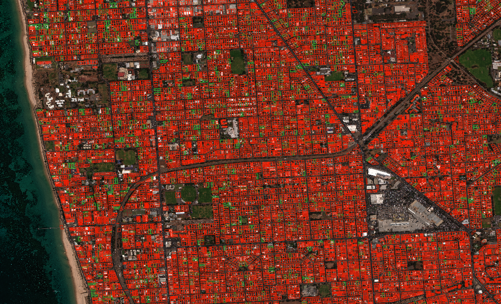

# Pool Detection Using Deep Learning

## Table of Contents

1. [About PoolNet](#about-poolnet)
2. [Getting Started](#getting-started)
    * [Setting up your EC2 Instance](#setting-up-anec2-instance-with-theano)
    * [Setting up a Virtual Environment](#setting-up-an-environment)
3. [PoolNet Workflow](#poolnet-workflow)

## About PoolNet

PoolNet utilizes the [VGG-16](https://arxiv.org/pdf/1409.1556.pdf) network architecture, a 16-layer convolutional neural network, the top-scoring submission for the 2014 [ImageNet](http://www.image-net.org/challenges/LSVRC/2014/) classification challenge.

(show vggnet architecture img)

This network is trained on satellite images of various property polygons in order to classify these properties as ones with or without pools (see image below). This model provides an efficient and reliable way to determine which homes have pools, information that is useful to insurance companies. With appropriate training data this model can be extended to applications beyond pools, such as vehicles, solar panels and buldings.

  
 Example property polygons. Red indicates no pool, green indicates that there is a pool within the polygon. 

### The challenge:

Pools turn out to be very diverse in satellite images

## Getting Started  

PoolNet requires a GPU to prevent training from being prohibitively slow. Before getting started you will need to set up an EC2 instance with Theano.

### Setting up an environment

1. Create the environment:  

        conda create -n geo python ipython numpy scipy gdal git libgdal=2  

2. upgrade pip:  

        pip install --upgrade pip  

3. install mltools:  

        pip install mltools

### Setting up an EC2 Instance With Theano  

Set up an Ubuntu g2.2xlarge EC2 GPU ubuntu instance on AWS

Follow steps 1 - 9 on [this tutorial](http://markus.com/install-theano-on-aws/).  
In short:

1. Update packages:  

        sudo apt-get update  
        sudo apt-get -y dist-upgrade

2. Open tmux:  

        tmux  

3. Install dependencies:  

        sudo apt-get install -y gcc g++ gfortran build-essential git wget linux-image-generic libopenblas-dev python-dev python-pip python-nose python-numpy python-scipy

4. Install bleeding-edge version of Theano:  

        sudo pip install --upgrade --no-deps git+git://github.com/Theano/Theano.git  

5. Get cuda toolkit (7.0):  

        sudo wget http://developer.download.nvidia.com/compute/cuda/repos/ubuntu1404/x86_64/cuda-repo-ubuntu1404_7.0-28_amd64.deb  
6. Depackage cuda:  

        sudo dpkg -i cuda-repo-ubuntu1404_7.0-28_amd64.deb  

7. Add package and install cuda driver (~5 min)  

        sudo apt-get update  
        sudo apt-get install -y cuda  

8. Add cuda nvcc and ld_library_path to path:  

        echo -e "\nexport PATH=/usr/local/cuda/bin:$PATH\n\nexport LD_LIBRARY_PATH=/usr/local/cuda/lib64" >> .bashrc  

9. Reboot:  

        sudo reboot  

10. Create a .theanorc in the /home/ubuntu/ directory as follows:  

<b>.theanorc config: </b>  

        [global]  
        floatX = float32  
        device = gpu  
        optimizer = fast_run  

        [lib]  
        cnmem = 0.9

        [nvcc]  
        fastmath = True

        [blas]  
        ldflags = -llapack -lblas  

## PoolNet Workflow

Start with a geojson shapefile and associated tif images:  

   
 Pansharpened tif image with associated polygons overlayed. Green polygons indicate there is a pool in the property. 

### Prepare materials and train net

1. Filter shapefile for legitimate polygons (mltools.geojson_tools.filter_polygon_size). Use resolution to determine minimum and maximum acceptable side dimensions for polygons (generally between 30 and 150 pixels for pansharpened images).

    (Image of polygons over image)

2. create train and test geojsons with balanced classes (mltools.geojson_tools.create_balanced_geojson)

3. create iterators of polygons of appropriate size zero-padded to input shape (mltools.data_extractors.get_iter_data)

    (show polygon processing imgs)

4. train PoolNet on training data generators
