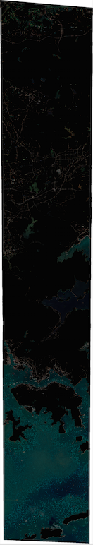

This readme is under construction...

# Object Detection using Pansharpened Imagery and Convolutional Neural Networks.

## Table of Contents

1. [About](#about)
2. [Getting and viewing the imagery](#getting-and-viewing-the-imagery)
3. [Applying a water mask](#applying-a-water-mask)
4. [Training and testing the chip classifier](#training-testing-the-chip-classifier)
5. [Detecting boats](#detecting-boats)
6. [Viewing the results](#viewing-the-results)

## About

In this example, we implement a boat detector on pansharpened imagery of the Hong Kong harbor.
Detection is performed by sliding a window across the image and applying a classifier on each chip.
The classifier is a [convolutional neural network](http://neuralnetworksanddeeplearning.com/chap6.html#introducing_convolutional_networks) (CNN) which is trained using a boat data set obtained via
a Tomnod crowdsourcing campaign.

Follow the instructions [here](https://github.com/DigitalGlobe/mltools/tree/master/examples/polygon_classify_cnn#setting-up-your-ec2-instance) in order to set up an EC2 instance with cuda.
This is not necessary but it will significantly speed up CNN computations.

## Getting and viewing the imagery

We will use [gbdxtools](http://github.com/DigitalGlobe/gbdxtools) to order the raw image with catalog id
1030010038CD4D00 and then produce an atmospherically compensated pansharpened image.

First, we need to activate the conda environment we created to install mltools:

        > source activate env

Open ipython and create a gbdx interface:

        >> from gbdxtools import Interface
        >> gbdx = Interface()

Then order the image:

        >> order_id = gbdx.ordering.order('1030010038CD4D00')

The order might take a while. You can check on the order status as follows:

        >> result = gbdx.ordering.status(order_id)
        >> print result
        >> [{u'acquisition_id': u'1030010038CD4D00',
        u'location': u's3://receiving-dgcs-tdgplatform-com/055269115010_01_003',
        u'state': u'delivered'}]

The key 'location' specifies the location of the ordered image on S3. We store this because we will need it:

        >> data = result[0]['location']

We now execute the following steps in order to produce the pansharpened image.

        >> aoptask = gbdx.Task('AOP_Strip_Processor', data=data, enable_acomp=True, enable_pansharpen=True)
        >> workflow = gbdx.Workflow([aoptask])
        >> workflow.savedata(aoptask.outputs.data, location='kostas/hongkong')
        >> workflow.execute()
        >> u'435481283923328752'

The workflow might take a while to complete. We can check on its status as follows:

        >> workflow.status
        >> {u'event': u'started', u'state': u'running'}

When the workflow is done, its state will be 'complete'. This means that we can download the corresponding image locally.

        >> gbdx.s3.download('kostas/hongkong/ps')

This command will download a number of files which include shapefiles and imagery metadata.
We are only interested in the tif file so you can delete the rest of the files (they will not be of any use in this example).
In addition, rename the tif file to '1030010038CD4D00.tif' as this is how the image is identified in our boat data set.

We can download the pansharpened image on a computer where QGIS is installed and view it there. However, this is a painful procedure as the image file is huge (you probably felt this pain when you downloaded the image to your ec2 instance).
Enter [IDAHO](http://gbdxdocs.digitalglobe.com/v1/page/labs). IDAHO is a cloud-based, data storage format implemented on GBDX, which allows fast, tile-based access to imagery.

You can easily create a leaflet map of the pansharpened image using gbdxtools. In ipython:

        >> gbdx.idaho.create_leaflet_viewer(gbdx.idaho.get_images_by_catid('1030010038CD4D00'), 'my_map.html')

This is the [result](http://kostasthebarbarian.github.io/mltools/examples/detector_cnn/my_map.html). (You will need a gbdx access token in order to view this page which you can find at ~/.gbdx-config.) A big part of the image is land - no boats there! It is therefore a good idea to apply a water mask in order to reduce the search area.

## Applying a water mask

We can use the GBDX [protogenv2RAW](https://github.com/TDG-Platform/docs) task in order to generate a water mask for 1030010038CD4D00; protogenv2RAW requires an atmospherically compensated multi-spectral image in order to produce the water mask. A water mask is a 'binary' image; it is black on land and white on water. The steps in ipython are outlined below; the argument 'data' is the same as above since the water mask will be generated from the same raw image.

        >> aoptask = gbdx.Task('AOP_Strip_Processor', data=data, enable_acomp=True, enable_pansharpen=False, bands='MS', enable_dra=False)            # creates acomp'd multispectral image
        >> gluetask = gbdx.Task('gdal-cli')  # move aoptask output to root where prototask can find it
        >> gluetask.inputs.data = aoptask.outputs.data.value
        >> gluetask.inputs.execution_strategy = 'runonce'
        >> gluetask.inputs.command = """mv $indir/*/*.tif $outdir/"""           
        >> prototask = gbdx.Task('protogenV2RAW')
        >> prototask.inputs.raster = gluetask.outputs.data.value
        >> workflow = gbdx.Workflow([aoptask, gluetask, prototask])
        >> workflow.savedata(prototask.outputs.data, location='kostas/hongkong')
        >> workflow.execute()

The gdal-cli task is a **multi-purpose** task: you can pass it any bash argument. In this example, we use it as 'glue'
between the aoptask and prototask (it moves the output of aoptask to where prototask can find it).

This is what the watermask looks like:

The pansharpened image and the water mask are now in the same directory in s3 ('kostas/hongkong').
The next step is to multiply each band of the pansharpened image with the water mask in order to produce the masked pansharpened image.
This requires the water mask to be upsampled so that it has the same dimensions as the pansharpened image. Both upsampling and multiplication
are executed within the gdal-cli task.

        >> multiplytask = gbdx.Task('gdal-cli')
        >> multiplytask.inputs.data = 's3://gbd-customer-data/58600248-2927-4523-b44b-5fec3d278c09/kostas/hongkong'     # you need to know your bucket/prefix combo here: you can get it with gbdx.s3.info
        >> multiplytask.inputs.command = """dims="$(gdalinfo 1030010038CD4D00.tif | grep 'Size is' | awk '{ print substr( $0, 8, length($0)  ) }' | sed 's/,/ /g')";
                                            gdal_translate -outsize $dims 1030010038CD4D00_mask.tif 1030010038CD4D00_mask_resampled.tif;
                                            gdal_calc.py -A 1030010038CD4D00.tif -B 1030010038CD4D00_mask_resampled.tif --calc=A*(B>0) --allBands=A --outfile=1030010038CD4D00_masked.tif"""

We now want to upsample the watermask so that it has the same dimensions as the pansharpened image.

To get the size of the pansharpened image on the command line:

        > dims="$(gdalinfo 1030010038CD4D00.tif | grep 'Size is' | awk '{ print substr( $0, 8, length($0)  ) }' | sed 's/,/ /g')"
        > echo $dims       
        38516 223054

From the command prompt, we can resample the water mask using the gdal_translate utility:

        > gdal_translate -outsize $dims 1030010038CD4D00_mask.tif 1030010038CD4D00_mask_resampled.tif
        Input file size is 9651, 55736
        0...10...20...30...40...50...60...70...80...90...100 - done.

And to apply the mask:

        > gdal_calc.py -A 1030010038CD4D00.tif -B 1030010038CD4D00_mask_resampled.tif --calc=A*(B>0) --allBands=A --outfile=1030010038CD4D00_masked.tif
        0 .. 10 .. 20 .. 30 .. 40 .. 50 .. 60 .. 70 .. 80 .. 90 .. 100 - Done

This is what the masked pansharpened image looks like:

## Training and testing the chip classifier

The file boats.geojson contains the coordinates of about 4000 boats which were tagged by the Tomnod crowd.
You can view this data set [here](http://kostasthebarbarian.github.io/mltools/examples/detector_cnn/my_map_with_points.html). In order to create this file, we have used the [Leaflet.markercluster](https://github.com/Leaflet/Leaflet.markercluster) library to create marker clusters which are displayed on top of the IDAHO tiles.  

## Detecting boats

## Viewing the results
