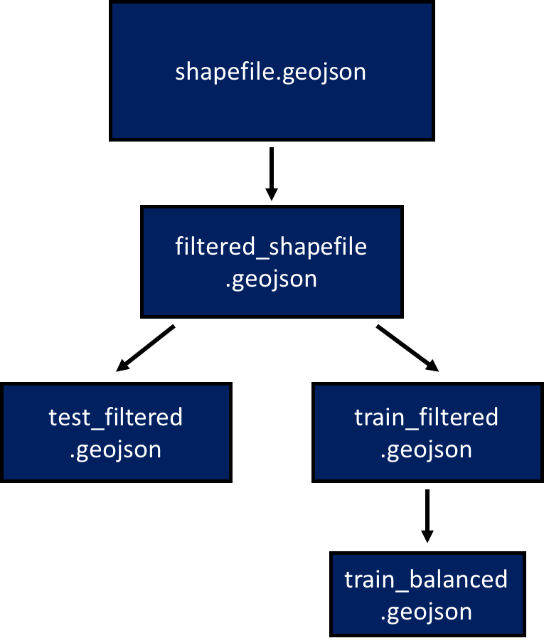
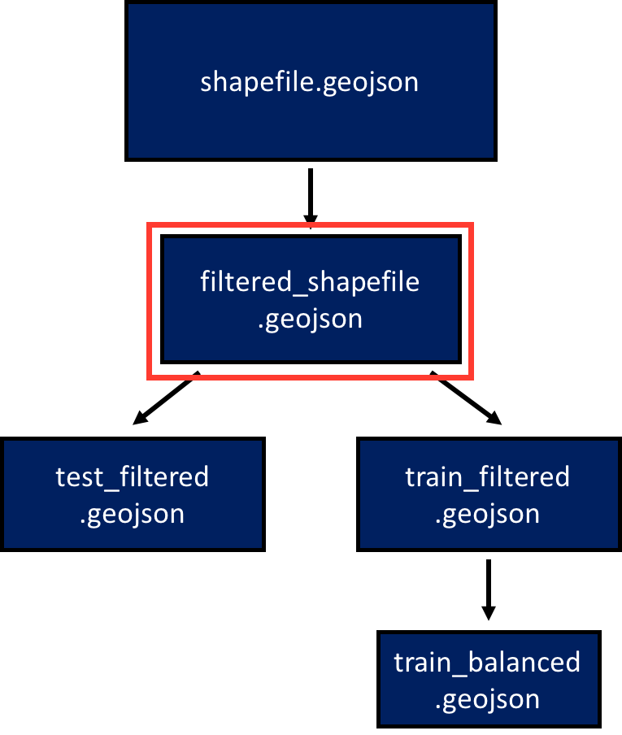
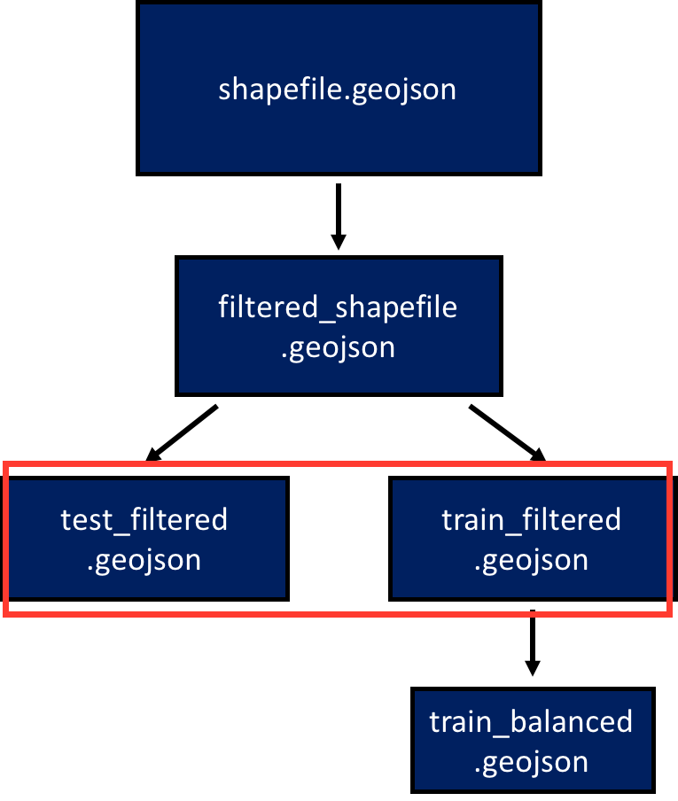

# Pool Detection Using Deep Learning

## Table of Contents

1. [About PoolNet](#about-poolnet)
    * [The Challenge](#the-challenge)
    * [Network Architecture](#network-architecture)
2. [Getting Started](#getting-started)
    * [Setting up your EC2 Instance](#setting-up-your-ec2-instance)
    * [Setting up an Environment](#setting-up-an-environment)
3. [PoolNet Workflow](#poolnet-workflow)
    * [Getting the Imagery](#getting-the-imagery)
    * [Prepare Shapefile](#prepare-shapefile)
    * [Training the Network](#training-the-network)
        - [Create the Training Chips](#create-the-training-chips)
        - [First Training Phase](#first-training-phase)
        - [Second Training Phase](#second-training-phase)
    * [Testing the Network](#testing-the-network)
4. [Performance](#performance)
    * [Results](#results)
    * [Misclassified Polygons](#misclassified-polygons)

## About PoolNet

PoolNet uses deep learning with a [convolutional neural network](http://neuralnetworksanddeeplearning.com/chap6.html#introducing_convolutional_networks) to classify satellite images of various property polygons as homes with or without a pool. This model provides an efficient and reliable way to identify homes with swimming pools, information that is valuable to insurance companies and would otherwise be challenging to collect at a large scale. With appropriate training data this model can be extended to various applications such as vehicles, boats, solar panels and buildings.

  
 Example property polygons. Red indicates no pool, green indicates that there is a pool within the polygon.   

### The Challenge

Pools turn out to be very diverse in satellite images, varying in shape, color, tree-coverage and location. A convolutional neural network is therefore well-suited for machine detection of pools, providing the flexibility to learn common abstract qualities of the item of interest independently of location in the input image. The vast number of parameters trained in PoolNet allows it to learn a variety of features that pools have that other machine learning techniques and even the human eye may overlook.

  
Various pool-containing polygons from the test data. Notice the diversity in shape, size, color, intensity and location in the polygon. This makes machine classification of pools very challenging.   

### Network Architecture

PoolNet utilizes the [VGG-16](https://arxiv.org/pdf/1409.1556.pdf) network architecture, a 16-layer convolutional neural network and the top-scoring submission for the 2014 [ImageNet](http://www.image-net.org/challenges/LSVRC/2014/) classification challenge. This architecture is composed of many small (3x3) convolutional filters, which enables such a deep network to be trained and deployed in a timely manner on a GPU.  

<b>VGG-16 Architecture</b>  
  
Architecture of VGGNet. The input layer (blue) is comprised of a 3-channel pansharpened rgb property polygon. Each green layer represents a convolution of the original image with a 3x3 kernel. Max-pooling layers (denoted by the black MP) are used for downsampling the convolved image by taking only the most intense of a given pool of pixels. The yellow layers at the end represent fully connected layers where all remaining pixels are flattened into a 2-dimensional layer of nodes. Finally two nodes of the the softmax layer at the end each represent one class (pool or no pool) and produces a probability the the input image belongs to that class.   

## Getting Started  

PoolNet should run on a GPU to prevent training from being prohibitively slow. Before getting started you will need to set up an EC2 instance with Theano.

### Setting up your EC2 Instance

Begin by setting up an Ubuntu g2.2xlarge EC2 GPU ubuntu instance on AWS.  

Follow steps 1 - 9 on [this tutorial](http://markus.com/install-theano-on-aws/).  
In short:

1. Update packages:  

        >> sudo apt-get update  
        >> sudo apt-get -y dist-upgrade

2. Open tmux:  

        >> tmux  

3. Install dependencies:  

        >> sudo apt-get install -y gcc g++ gfortran build-essential git wget linux-image-generic libopenblas-dev python-dev python-pip python-nose python-numpy python-scipy

4. Get cuda toolkit (7.0):  

        >> sudo wget http://developer.download.nvidia.com/compute/cuda/repos/ubuntu1404/x86_64/cuda-repo-ubuntu1404_7.0-28_amd64.deb  

5. Depackage cuda:  

        >> sudo dpkg -i cuda-repo-ubuntu1404_7.0-28_amd64.deb  

6. Add package and install cuda driver (~5 min)  

        >> sudo apt-get update  
        >> sudo apt-get install -y cuda  

7. Add cuda nvcc and ld_library_path to path:  

        >> echo -e "\nexport PATH=/usr/local/cuda/bin:$PATH\n\nexport LD_LIBRARY_PATH=/usr/local/cuda/lib64" >> .bashrc  

8. Reboot:  

        >> sudo reboot  

9. Create a file entitled .theanorc in the /home/ubuntu/ directory as follows:  

    <b>.theanorc config: </b>  

            [global]  
            floatX = float32  
            device = gpu  
            optimizer = fast_run  

            [lib]  
            cnmem = 0.9

            [nvcc]  
            fastmath = True

            [blas]  
            ldflags = -llapack -lblas  

### Setting up an Environment

Before training your net be sure to install mltools and activate your conda environment ([instructions](https://github.com/digitalglobe/mltools#installationusage)).  

**Note**: to run PoolNet you must install the current version of the master branch:  

    >> pip install git+https://github.com/DigitalGlobe/mltools

## PoolNet Workflow

The steps described here require a pansharpened tif image, an associated shapefile (shapefile.geojson) containing labeled polygon geometries, and [pool_net.py](https://github.com/DigitalGlobe/mltools/blob/master/examples/polygon_classify_cnn/pool_net.py) placed in the same directory.

   
 Pansharpened tif image with associated polygons overlayed. Green polygons indicate there is a pool in the property. 

### Getting the Imagery

Order, create and download the pansharpened image with catalog id 1040010014800C00 using [gbdxtools](http://github.com/DigitalGlobe/gbdxtools). Instructions can be found [here](http://gbdxtools.readthedocs.io/en/latest/) and [here](https://github.com/DigitalGlobe/mltools/tree/master/examples/polygon_classify_random_forest). This is the image where we will be classifying property parcels in those that contain swimming pools and those that don't.

### Prepare Shapefile

<b>In this section we will create the following shapefiles:</b>

  

a. <b>shapefile.geojson</b>: Original file with all polygons.  
b. <b>filtered_shapefile.geojson</b>: File with all polygons with side dimensions between 30 and 125 pixels.  
c. <b>test_filtered.geojson</b>: Test data with filtered polygons and unbalanced classes. Don't touch it until testing the model!  
d. <b>train_filtered.geojson</b>: Unbalanced training data, which will be used in the second round of training.  
e. <b>train_balanced.geojson</b>: Balanced training data. This is what we will use for the first round of training.   

We initially filter shapefile.geojson to get rid of polygons that are too small. We then create train and test data, as well as a batch of training data with balanced classes, the motivation for which is detailed [below](#first-training-phase). If you do not have access to shapefile.geojson, there are sample filtered train and test geojsons (test_filtered.geojson, train_filtered.geojson, and train_balanced.geojson), which are sufficient for training and testing the model, so you can omit this section and continue to [Training the Network](#training-the-network).  

1. **Create filtered_shapefile.geojson:**

    

    Open an ipython terminal and filter your original shapefile for legitimate polygons. Use resolution to determine minimum and maximum acceptable chip size dimensions (generally between 30 and 125 pixels for pansharpened images).  

        >> import mltools.geojson_tools as gt
        >> gt.filter_polygon_size('shapefile.geojson', 'filtered_shapefile.geojson', min_polygon_hw=30, max_polygon_hw=125)

2. **Create train_filtered.geojson and test_filtered.geojson:**

    

        >> gt.create_balanced_geojson('filtered_shapefile.geojson', output_file = 'filtered.geojson', balanced = False, train_test = 0.2)

3. **Create balanced training data 'train_balanced.geojson':**  

    

        >> gt.create_balanced_geojson('train_filtered.geojson', output_file = 'train_balanced.geojson')

### Training the Network  

Before training the network, make sure to create a 'models' folder in the directory from which you will be running the training. The model will automatically save the weights after each epoch of training to this directory. *You will get an IO error if you omit this step*:

        >> mkdir models

#### Create the Training Chips

  
 Sample chips used as input for PoolNet. Notice that only the contents of the polygon are being input to the net.  

The training chips and corresponding labels are extracted from train_balanced.geojson as follows:   

1. Create the generator object:  

        >> import mltools.data_extractors as de
        >> data_generator = de.get_iter_data('train_balanced.geojson', batch_size=10000, max_chip_hw=125, normalize=True)  

    *You will need to set the batch size small enough to fit into memory. If this does not produce sufficient training data (~10,000 chips) see [the docs](https://github.com/digitalglobe/mltools/blob/master/examples/polygon_classify_cnn/PoolNet_docs.md) for information on how to train directly on a generator using the [fit_generator](https://github.com/digitalglobe/mltools/blob/master/examples/polygon_classify_cnn/PoolNet_docs.md#fit_generator) function.*

2. Generate a batch of chips and labels (x and y):  

        >> x, y = data_generator.next()  

    We zero-pad each chip outside of the polygon to eliminate any surrounding objects from neighbors that could cause a false positive, and also to standardize the shape and general composition of the input data, as is necessary for convolutional neural networks (see figure below). Additionally, we ensure that the pixel intensity data is normalized (between 0 and 1) by dividing each pixel by 255. Some sample chips can be seen in the figure below.  

We are now ready to train PoolNet on the chips we have generated. The motivation behind the training methodology is detailed below.

#### First Training Phase

One challenge that the data in this example presents is that only about 6% of the polygons actually contain pools. This class imbalance causes the net to learn only the statistical probability of encountering a pool, and thus produce only 'non-pool' classifications. To force the net to instead learn the general attributes of pools based on image composition, we train it on balanced data (equal number of 'pool' and 'no pool' polygons).  

1. Create a PoolNet instance:

        >> from pool_net import PoolNet
        >> p = PoolNet(input_shape = (3,125,125), batch_size = 32)

    This step creates a PoolNet instance with appropriate parameters. The input_shape parameter should be entered as (n_channels, max chip height, max chip width). Note that RGB images have 3 channels.  

2. Train the network:

        >> p.fit_xy(X_train = x, Y_train = y, save_model = 'my_model', nb_epoch=15)  

    The final command executes the training on the x and y data you created in the previous section. The nb_epoch argument defines how many rounds of training to perform on the network. In general this should be until validation loss stops decreasing. Weights for the model will be saved after each epoch, so it is possible to roll back the training if necessary.

#### Second Training Phase

After this round of training the model produces over 90% precision and recall when tested on *balanced* classes. Testing this model on data that is representative of the original data brings the precision down to around 72%, indicating an unacceptably high rate of non-pool chips being classified as having pools. To see these results for yourself, create balanced and unbalanced test data by completing the steps below, then use that data to complete steps 2-5 in [testing the network](#testing-the-network).

        # make balanced test data
        >> x_balance_test, y_balance_test = data_generator.next()

        # make unbalanced test data
        >> unbal_generator = de.get_iter_data('train_filtered.geojson', batch_size=5000, max_chip_hw=125, normalize=True)
        >> x_unbal_test, y_unbal_test = unbal_generaor.next()

To minimize the false positive rate without harming recall, we retrain only the output layer on imbalanced classes. This simultaneously preserves the way that the net detects pools, while decreasing the probability the then network will generate a positive label.  

1. Create unbalanced data generator:

        >> unbal_generator = de.get_iter_data('train_filtered.geojson', batch_size=5000, max_chip_hw=125, normalize=True)  

2. Generate X and Y:  

        >> x, y = unbal_generator.next()
        # Creates unbalanced training data  

3. Retrain final layer of network:  

        >> p.retrain_output(X_train=x, Y_train=y, nb_epoch=20)  

If you already have a saved model architecture and weights, you may load those using the *load_model=True* argument when creating an instance of the PoolNet class. You then may load the associated weights from an h5 file.  

        >> p = PoolNet(input_shape = (3,125,125), batch_size = 32, load_model=True, model_name = 'model_name.json')
        >> p.model.load_weights('model_weighs.h5')
        # Produces a model with loaded weights that can be used for testing and deployment

### Testing the Network  

We now have a fully trained network that is ready to be tested. Here we will produce a confusion matrix from 2500 test polygons.  

1. Generate test data from test_filtered.geojson:  

        >> test_generator = de.get_iter_data('test_filtered.geojson', batch_size=2500, max_chip_hw=125, normalize=True)
        >> x,y = test_generator.next()
        # Creates test data  

2. Use model to predict classes of test chips:

        >> y_pred = p.model.predict_classes(x)  

3. Convert y from one-hot encoding to list of classes:

        >> y_true = [i[1] for i in y]  

4. Create confusion matrix from y_true and y_pred:  

        >> from sklearn.metrics import confusion_matrix

        >> print confusion_matrix(y_true, y_pred)
        # [[true_positives  false_positives]
        # [false_negatives  true_negatives]]  

5. Calculate precision and recall:

        >> precision = float(tp) / (tp + fp)
        >> recall = float(tp) / (tp + fn)  

### Visualizing Results  

For visualization of the results we must create a new geojson shapefile for which each polygon has PoolNet classification, certainty of the classification and the ground truth listed as properties. Here we will classify all polygons in test_filtered.geojson and save them to test_classed.geojson. We will then use the classified shapefile to visualize polygon classifications overlayed on the original tif image (1040010014800C00.tif).  

Complete the first step only if you would like to classify your own data. Otherwise just use test_classed.geojson and continue on to step 2.  

1. Classify all test data (this will take some time):

        >> p.classify_shapefile('test_filtered.geojson', test_classed.geojson')  

2. Open 1040010014800C00.tif in QGIS:  

    **Layer > Add Layer > Add Raster Layer...**  

      

    **Select appropriate tif image**  

     ->
    

3. Open test_classed.geojson as a vector file:  

    **Layer > Add Layer > Add Vector Layer...**  
      

    **Select test_classed.png**  
     ->
      

4. Color Polygons by Category:

    **Layer > Properties**  
    *Vector layer must be highlighted*  
      

    **Select Ground Truth Property, click 'Classify'**  
     ->
      

    **Format polygons by class**  
     ->
      

    **change fill to transparent**  
    
    <idmg src='images/QGIS_border.png' width=100>  

    **Result**  
      
    Classified geojson with polygons colored by ground-truth class.

## Performance  

Below is an overview of the model's performance on test data.

### Results

The current top model was trained first on 9000 polygons with balanced classes (+1000 for validation) for 15 epochs, followed by 20 epochs on 4500 unbalanced classes. Testing this model on initial test data gives a precision and recall of 83% and 92%, respectively. The original test data, however, appears to be flawed upon visual inspection of results (see [below](#misclassified-polygons)). We therefore needed a method for getting accurate metrics. To accomplish this we classified 1650 test polygons manually, using multiple sources to confirm the true classification of each polygon. We then compared the results to the original test data as well as PoolNet classifications. The reliable test data indicates a precision of 88% and recall of 93% by our model. Results are summarized in the table below.  

#### Test Dataset #1:  

  
 Results of pool classification based on the original (flawed) 'ground truth' data 

#### Test Dataset #2:    

  
 Results of classification based on the accurate ground truth data 

Check back for future results as we continue to improve the model.  

### Misclassified Polygons

Upon manual inspection of the results a few of the causes of misclassification became apparent. Firstly, swimming pools that are partially covered by trees or a tarp, empty, small, or with green water were often falsely classified as 'no pool'. However, the ground truth also appeared to have some incorrectly classified polygons, which the model was actually classifying correctly, despite being marked as a false negative.  

Similarly, a large portion of the geometries that were marked as false positives were actually incorrectly labeled polygons that do have pools. Genuine false positives were usually due to a bright blue object in the back yard with a similar color to many pools. See below for some examples of polygons falsely classified by PoolNet.  

  
 Samples of pools that the net misclassified. Notice that many are difficult to see, covered by trees, unusually dark or at the edge of the bounding box. 
