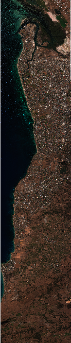
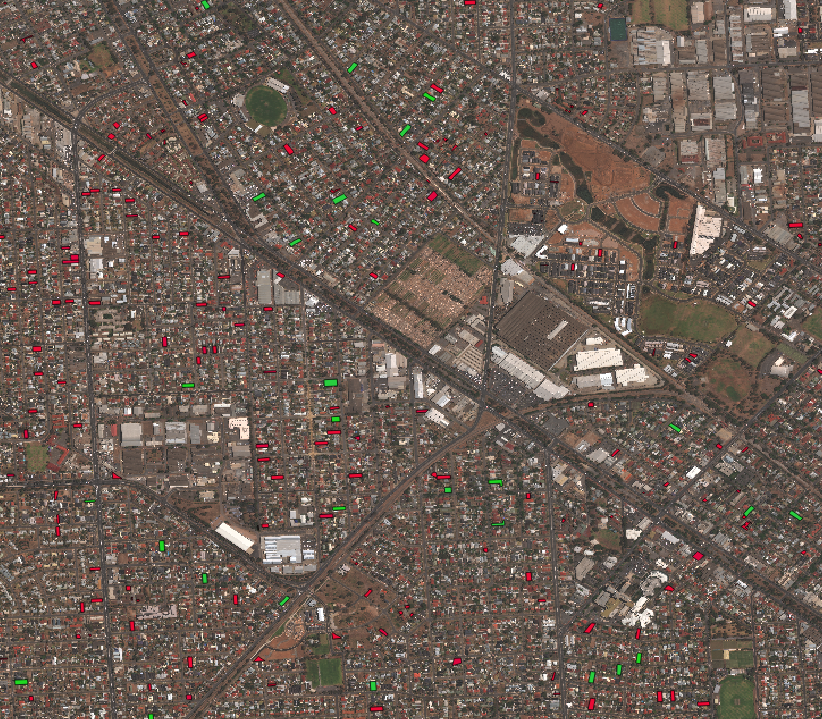

# Polygon Classification using Multispectral Imagery and Random Forests

## Table of Contents

1. [About](#about)
2. [Getting the imagery](#getting-the-imagery)
3. [Training, testing and deploying the classifier](#training-testing-and-deploying-the-classifier)

## About

In this example, we implement a classifier which can classify polygons of arbitrary geometry as
'Contains swimming pool' or 'Does not contain swimming pool'. Classification is performed by 
computing a feature vector using WorldView-2, 8-band imagery and feeding the feature vector to a Random Forest
Classifier. The classifier is trained using a set of polygons which have been labeled with high confidence
by the Tomnod crowd.

The example walks the user through the following steps:

+ Ordering the multispectral imagery from GBDX.

+ Training the classifier on a training data set and testing the classifier on a test data set.

This work was performed as part of the PSMA project whose goal is to provide a number of information layers on millions
of property parcels across urban centers in Australia. More information can b

## Getting the imagery

We will use gbdxtools (http://github.com/DigitalGlobe/gbdxtools) to order the image with catalog id 1040010014800C00
which constitutes our Area Of Interest. We will then run a workflow to produce an atmospherically 
compensated (acomped) multi-spectral image which will be used to train the classifier,
and a workflow to produce a pan-sharpened image which will be used in order to visualize our results.
Detailed information on gbdxtools can be found at http://gbdxtools.readthedocs.io/.

First, we need to activate the conda environment we created to install mltools:

        source activate env

Then install gbdxtools:

        pip install gbdxtools

Open ipython and create a gbdx interface:

        >> from gbdxtools import Interface
        >> gbdx = Interface()

Then order the image:

        >> order_id = gbdx.ordering.order('1040010014800C00')

The order might take a while. You can check on the order status as follows:

        >> result = gbdx.ordering.status(order_id)
        >> print result
        >> [{u'acquisition_id': u'1040010014800C00', u'location': u's3://receiving-dgcs-tdgplatform-com/055317677010_01_003', u'state': u'delivered'}]

The key 'location' specifies the location of the ordered image on S3. We store this because we will need it:

        >> data = result[0]['location']

We now execute the following steps in order to produce the acomped multi-spectral image and the pansharpened image.

        >> aoptask1 = gbdx.Task("AOP_Strip_Processor", data=data, enable_acomp=True)
        >> workflow1 = gbdx.Workflow([aoptask1])
        >> workflow1.savedata(aoptask1.outputs.data, location='kostas/pools/multispectral')
        >> workflow1.execute()
        >> u'4346825990110459472'
        >> aoptask2 = gbdx.Task("AOP_Strip_Processor", data=data, enable_acomp=True, enable_pansharpen=True)
        >> workflow2 = gbdx.Workflow([aoptask2])
        >> workflow2.savedata(aoptask2.outputs.data, location='kostas/pools/pansharpened')
        >> workflow2.execute()
        >> u'4346826806501479525'

The workflows might take a while to complete. We can check on their status as follows:

        >> workflow1.status
        >> {u'event': u'started', u'state': u'running'}
        >> workflow2.status
        >> {u'event': u'submitted', u'state': u'pending'}

When the workflows are done, their state will be 'complete'. This means that we can download the corresponding images locally.

        >> mkdir multispectral 
        >> gbdx.s3.download('kostas/pools/multispectral', './multispectral')
        >> mkdir pansharpened
        >> gbdx.s3.download('kostas/pools/pansharpened', './pansharpened')

These commands will download a number of files which include shapefiles and imagery metadata. 
We are only interested in the tif files. Exit ipython, go into each directory and rename the tif file to '1040010014800C00.tif'.

        > cd multispectral
        > mv 055078617010_01_assembly.tif 1040010014800C00.tif
        > cd ..
        > cd pansharpened
        > mv 055078617010_01_assembly.tif 1040010014800C00.tif
        > cd ..

You can delete the rest of the files as they will not be of any use to you in this example. 

You will have noticed that the image files are huge. You can compress them for visualization purposes 
using the following gdal command from the command line:

        > cd pansharpened
        > gdal_translate -outsize 20% 20% 1040010014800C00.tif 1040010014800C00_downsampled.tif

You can open the file in QGIS (or a regular image viewer) in order to view it.
Here is a screenshot.

   
 Worldview-2 pansharpened image of Adelaide region, Australia.

## Training, testing and deploying the classifier

The training data set is found in train.geojson. (Detailed information on the geojson format can be found here: http://geojson.org/.) 
This is a collection of 1000 features (i.e., polygons, NOT to be confused with the feature vector that will be computed for each polygon by the algorithm), each consisting of a "geometry"
which includes the polygon coordinates, and a list of properties, i.e., "feature_id" (the polygon id), "image_id" (the image
catalog id on GBDX, which is 1040010014800C00 in this case) and "class_name" ("Swimming pool", "No swimming pool").
There are 500 polygons labeled "Swimming pool" and 500 polygons labeled "No swimming pool".  

The test data set is found in test.geojson. This a collection of 5000 polygons with the same format as in train.geojson. There are 500 features labeled "Swimming pool" and 4500 features labeled "No swimming pool". We select an imbalanced test data set because we have prior information that most properties in Adelaide do not contain swimming pools. (However, we will train the classifier on a balanced training set.)

Finally, the target data set is in target.geojson. This is a collection of 1000 polygons which are not labeled. The idea is that once 
the classifier is trained and tested, and we are happy with its performance, we can have it classify a set of unlabeled polygons from the same image.

Note that we can visualize geojson's by directly opening them on github. If we want to visualize them overlayed on the imagery, we need to use QGIS. Here is a screenshot of train.geojson, with green/red polygons indicating presence/absence of a pool, respectively.

   
 Green/red polygons indicate presence/absence of a pools, respectively.

Before proceeding, place the multispectral 1040010014800C00.tif in the same directory as the geojson files. 
Enter ipython and import the following modules:

        >> import numpy as np
        >> import warnings
        >> warnings.filterwarnings('ignore')   # suppress annoying warnings
        >> from mltools import features
        >> from mltools import data_extractors as de
        >> from mltools import geojson_tools as gt
        >> from sklearn.ensemble import RandomForestClassifier
        >> from sklearn.metrics import confusion_matrix

We now extract the pixel values within each polygon for all 8 bands as a masked numpy array. The get_data function of the data_extractors module uses geoio under the hood (http://github.com/digitalglobe/geoio). Setting return_labels=True ensures that the label for each polygon is returned (applicable only for the train and test data). Setting mask=True sets the pixel values to false for all pixels outside each polygon and within the polygon bounding box.

        >> train_rasters, _, train_labels = de.get_data('train.geojson', return_labels=True, mask=True)
        >> test_rasters, _, test_labels = de.get_data('test.geojson', return_labels=True, mask=True)
        >> target_rasters, target_ids = de.get_data('target.geojson', mask=True)

Following, we define the compute_features function. We use the pool_basic function found in the features module. This function
computes a 4-dim feature vector using a couple of predefined swimming pool spectral signatures.

        >> compute_features = features.pool_basic

We compute the feature vectors for each pixel array:

        >> feature_vectors = []
        >> for raster in train_rasters + test_rasters + target_rasters:
        >>     feature_vectors.append(compute_features(raster))
        >> X = feature_vectors[:len(train_rasters)]
        >> Y = feature_vectors[len(train_rasters):len(train_rasters)+len(test_rasters)]
        >> Z = feature_vectors[len(train_rasters)+len(test_rasters):]

Now it is time to create the classifier object. We use 100 trees in the forest (but you are free to use more, compromising speed).

        >> c = RandomForestClassifier(n_estimators = 100)

Training:

        >> X, train_labels = np.nan_to_num(np.array(X)), np.array(train_labels)    # make sure to replace NaN with finite numbers
        >> c.fit(X, train_labels)
        >> class_names = c.classes_
        >> print class_names
        >> ['No swimming pool' 'Swimming pool']

Testing:

        >> Y, test_labels = np.nan_to_num(np.array(Y)), np.array(test_labels)    
        >> distributions = c.predict_proba(Y)
        >> inds = np.argmax(distributions, 1)
        >> predicted_labels, scores = class_names[inds], distributions[range(len(inds)),inds] 
        >> C = confusion_matrix(test_labels, predicted_labels)
        >> print C
        >> [[4396  104]
        [  23  477]]

The confusion matrix reveals that, based on the test data, there are 104 false positives ('No swimming pool' misclassified as 'Swimming pool') and 23 false negatives ('Swimming pool' misclassified as 'No swimming pool'). So, for this particular data set the precision and recall are:

        precision = 477 / (477 + 104) = 82%
        recall = 477 / (477 + 23) = 95%

If we are happy with these numbers (they are pretty good for such a simple classifier!), we can deploy the classifier on the target data set.

        >> Z = np.nan_to_num(np.array(Z))                               
        >> distributions = c.predict_proba(Z)
        >> inds = np.argmax(distributions, 1)
        >> predicted_labels, scores = class_names[inds], distributions[range(len(inds)),inds] 

The results are written to classified.geojson as follows:

        >> gt.write_properties_to(data = zip(predicted_labels, scores), 
                       property_names = ['class_name', 'score'], 
                       input_file = 'target.geojson',
                       output_file = 'classified.geojson',
                       filter={'feature_id':target_ids})

All the steps described in this section are found in polygon_classify_rf.py which can be run from the command prompt as:

        > python polygon_classify_rf.py        

